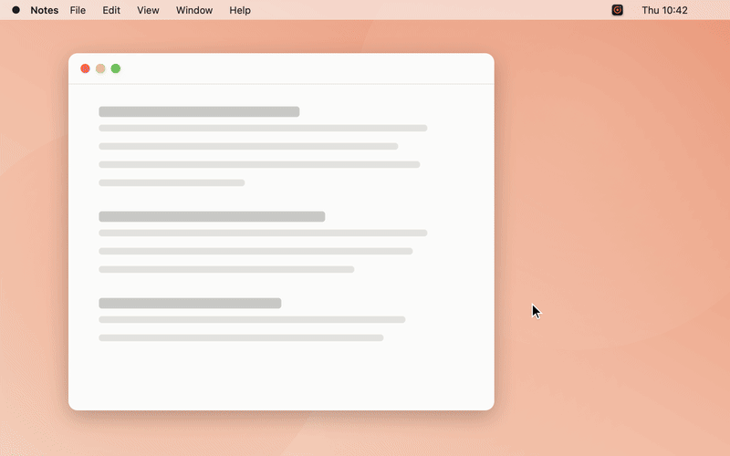

# Impact Capture

**Capture the work that never makes it into a commit.** · [Website](https://frugoman.github.io/impact-capture/)



The coffee chat that unblocked a team. The review comment that changed a design. The risk you called early. For senior engineers this is a big part of the job, it leaves no trace in Jira or GitHub, and it's gone from memory by review season.

Impact Capture is a small macOS menu bar app that catches it in the moment:

- **Check-ins at natural breaks.** When you come back to your Mac after time away, and once at the end of the day. Never mid-flow, capped per day, and it backs off if you keep skipping.
- **Talk or type in seconds.** Answer with Yes / No, a sentence, or your voice (transcribed on your Mac).
- **Log from anywhere.** A global shortcut (default `⌃⌥L`, or `⌃⌥⌘L` to talk) opens a quick-log box on every screen.
- **Plain Markdown you own.** One file per day, in a folder you pick. Export any period as a review-ready summary, or point your AI tool of choice at the folder.

## Install

With [Homebrew](https://brew.sh):

```bash
brew install --cask frugoman/tap/impact-capture
```

Or download the latest zip from [Releases](https://github.com/frugoman/homebrew-tap/releases?q=impact-capture), unzip it, move it to Applications and open it. Setup takes a minute: pick a folder, choose how often it may check in, and set your shortcuts.

Requires macOS 15 or later.

## Using it

Click the menu bar icon to open the popover:

- log something (type, or tap the mic) and tag it with a category;
- see today's and this week's captures, and edit or delete them;
- **Check in** to get a question now, **Export** a period, or pause check-ins.

Everything else lives in **Settings**: folder, speech language, check-in schedule, categories, questions, shortcuts, and integrations.

### The file format

```markdown
# Impact captures — 2026-09-17 (Thursday)

### 10:42 · prompt · away-return · voice · #collaboration

> Q: You were away 25 min. Did you talk to anyone about work?

Coffee with Marco from Payments. We agreed to split the migration into two PRs.
```

Entry header: `time · source · [trigger] · voice|typed · [#category]`.

- **source** is `prompt`, `shortcut`, `menu` or `raycast`.
- **trigger** is `away-return`, `end-of-day` or `manual`.
- The `> Q:` line is only there when the note answered a check-in.

### Using it with AI tools

Settings › Integrations has a ready-made prompt that explains the format and asks for performance evidence. Paste it into Claude, ChatGPT, Codex or anything else along with your captures folder.

### URL scheme

| URL | Does |
|---|---|
| `impactcapture://log?text=…&category=unblocking` | Save a note silently |
| `impactcapture://compose?category=…` | Open the quick-log box |
| `impactcapture://voice?category=…` | Open it already listening |
| `impactcapture://ask` | Ask a check-in question now |

The `raycast/` folder has Raycast script commands built on these URLs. Add the folder in Raycast › Settings › Extensions › Script Commands.

## Privacy

Nothing leaves your Mac. There is no server, no analytics and no account. Speech recognition runs on-device, and the microphone is only on while the capture box shows it's listening.

## Development

Needs Xcode 26 and [XcodeGen](https://github.com/yonaskolb/XcodeGen) (`brew install xcodegen`).

```bash
make install     # build Release, copy to ~/Applications, launch
make test        # unit tests for ImpactCaptureCore
make snapshots   # render every screen (light + dark) to build/snapshots
make icon        # regenerate the app icon
make release     # signed + notarized DMG (see scripts/release.sh for setup)
make brew-release  # release the zip + update the cask on frugoman/homebrew-tap
```

- `Sources/ImpactCaptureCore` has the pure logic: file format, storage, check-in policy, questions, stats and export. It's fully unit tested.
- `Sources/ImpactCapture` is the app: the status item popover, check-in panels, setup, settings, global shortcuts and dictation.

Before building locally, set `DEVELOPMENT_TEAM` in `project.yml` to your own team.

## License

MIT. See [LICENSE](LICENSE).
